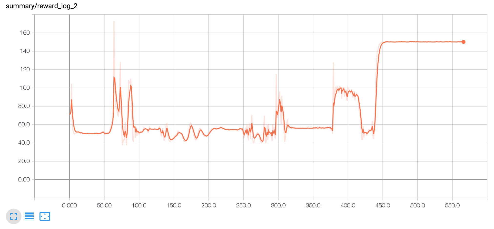

# Deep RL Quadcopter Controller

Training a quadcopter to take off using ***Actor-Critic*** approach based ***DDPG*** algorithm.

## Project Structure

- `task.py`: task (environment) is defined in this file.
- `agents/`: Folder containing reinforcement learning agents.
    - `actor.py` : actor class
    - `critic.py` : critic class 
    - `agent.py`: combined DDPG based RL agent is defined in this file.
- `physics_sim.py`: This file contains the simulator for the quadcopter.  **DO NOT MODIFY THIS FILE**.
- `Quadcopter_Train.ipynb` : Jupyter notebook containing step by step training process.

## Reward plot

Though the rewards should ideally be visualised using tensorboard (see the train function), here is how it looks like.

## Reflections

### Designing task and the reward function

* The agent is being trained for a takeoff task, which means the agent has to learn to fly above from its starting position to reach a target position. 

* I experimented with a number of reward functions which might force the agent to stay upright , avoid swinging around etc. However , as far as my experimentation goes a simple reward function with a negative L2 distance between current and target position works the best so far.(However, I am inclined to think that a those restrictions should help).

* Another important part of the reward function is a penalty term for going out of bounds(e.g hitting the ground) before a certain number of steps.This is essential because without this penalty term , the agent sometimes learns that ending the episode earlier (in order to cut-down the negative rewards for not reaching the target position) might be the best approach. 

*Possible Reward function = penalty + 1.0 - .03 * (L2 norm of the difference between target pos and current pos)*

for my reward function , penalty = -10 if episode ends before 240 timesteps.

* However I later found out that the penalty is not required if the agent is mostly rewarded positively for not going out of bounds. So for my specific initial and target position pair , the following reward function worked the best for me.

***Final Reward function = 1.0 - .01 * (L2 norm of the difference between target pos and current pos)***

### Learning Algorithm, Network Architecture and choice of hyperparameters

* The agent is based on the Deep Deterministic Policy Gradients(DDPG) model with a **prioritised experience replay**.It has an actor model which learns the policy used to decide which action to take based on the input state , and a critic model that evaluates the policy learnt by the actor model.

* Following is the choice of hyperparameters used by the model:
    - exploration_mu = 0
    - exploration_theta = .3 (increasing noise too much leads to unstable oscillating rotor speeds)
    - exploration_sigma = .4
    - buffer size = 100000  (tried reducing it to 10000 but the results get worse)
    - batch size = 64
    - gamma = .99
    
    Though the above hyperparameters are important , tuning these was not the hardest part.
 

* 

    **Actor Model**
        - [Fully connected , dim = 128 , BATCH NORM , RELU , DROPOUT] x 3
        - Fully connected ,  dim = action size , activation = sigmoid
        - Scale actions from [0,1] --> (action.low,action.high)
        
    **Critic Model**
        - States : [Fully connected , dim = 128 , BATCH NORM , RELU , DROPOUT] x 2
        - Actions : [Fully connected , dim = 128 , BATCH NORM , RELU , DROPOUT] x 2
        - Add(actions,states)
        - [Fully connected , dim = 128 , BATCH NORM , RELU , DROPOUT] x 2
        - Fully connected ,  dim = 1 , activation = None --> Q(state,action)

* However the most important part was to realise the need of **prioritised experience replay**. The need for prioritised experience replay increases many folds specially in tasks like these , where the exploration of high reward policies might be restricted by the stability issues of the agent.

### Comments on the learning curve

* My first intuition was that it should be an easy task , however as it turns out the stability issues of the quad make it into a 2 fold task : to stay afloat , and rise up to the target position.

* Even if we consider the stability problem to be solved : using single rotor control (same speed and noise for all rotors) , in order to effectively solve the task the agent has to learn to rise with high acceleration and then drop rotor speeds to deaccelerate to maximise reward. However the agent seemed to be struggling to learn this trick in reasonable episodes(though it learnt to rise to the target position fairly quickly). **You can try single rotor control by : 
`rl_agent = DDPG(task,single_rotor_control=True , prioritised_replay=True)`**

* The learning curve is characterized by an aha moment. However the trend was observed in most of my experiments including the **Pendulum-v0** gym environment. The reason for this is unclear to me yet. However , as is clear from the visualisations of the training code the agent sometimes goes to-fro between policies before suddenly getting on to the optimum policy. Such behaviour is understandable but I expected it to be more gradual.

* The final performance is OK , with reward of ~ 150

### Difficulties faced and final agent behaviour

* The hardest part was tuning the reward function to prevent it from falling down , adding penalties and so on.
* The quad somehow learns that it is best to almost turn off two diagonally opposite rotors , while giving thrust for
 the other two rotors(which is kinematically viable).This was odd for me , which prompted me to use a stronger dropout , however most of the times it converged to a similar policy.
