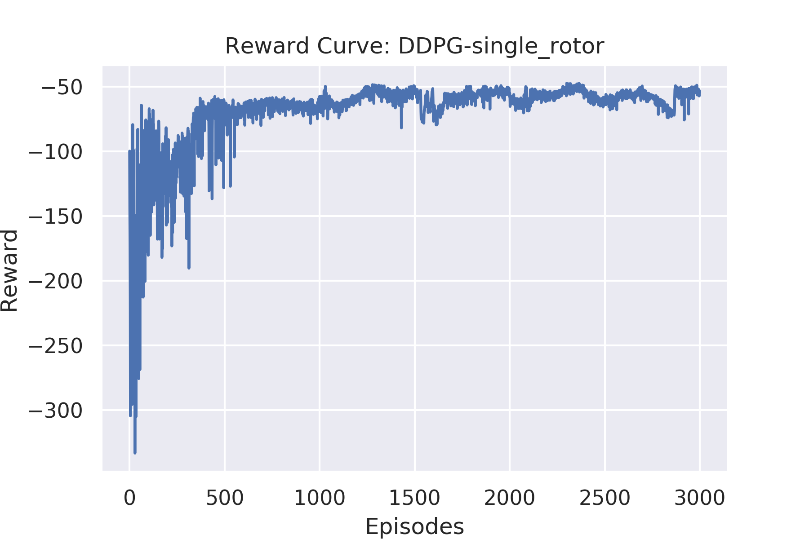
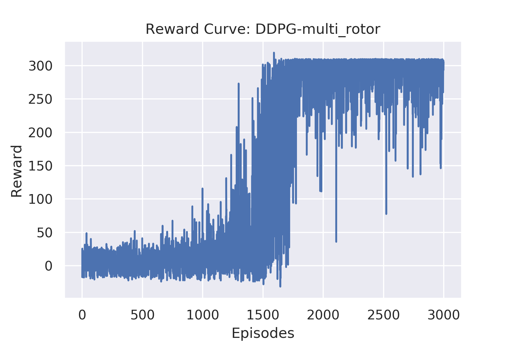

# Deep RL Quadcopter Controller

Training a quadcopter to take off using ***Actor-Critic*** approach based ***DDPG*** algorithm.


## Table of Contents

* [Quadcopter Environment](#quadcopter-environment)
* [Setup](#setup)
    * [System Configuration](#system-configuration)
    * [Environment Setup](#environment-setup)
    * [Instructions for getting started](#instructions-for-getting-started)
    * [Project Structure](#project-structure)
* [Algorithm Details](#algorithm-details)
* [Agent Performance](#agent-performance)
* [Bibliography](#bibliography)

## Quadcopter Environment

* **Observation Space**: size = 12
    - x,y,z coordinates: size = 3
    - Euler Angles (phi.theta,psi): size = 3
    - Velocities along the 3 axis (v_x,v_y,v_z): size = 3
    - Angular Velocities (v_phi,v_theta,v_psi): size = 3
* **Control Modes**: 2
    - Single rotor mode: all rotor speeds are equal
    - Multi rotor mode: all rotors are independent
* **Action Space** 
    - Size = 1 for single rotor mode
    - Size = 4 for multi rotor mode
* Boundary: 300 x 300 x 300 m
    - X: -150 --> 150 m
    - Y: -150 --> 150 m
    - Z: 0 --> 300 m
* **Boundary Conditions**
    - Hitting any of the environment boundaries leads to immediate termination of the episode
    - In addition, the `sim.in_bounds` flag is set to False, which can be used to assign any additional penalty for such a behaviour

# Setup

## System Configuration
The project was built with the following configuration:

* Ubuntu 16.04
* CUDA 10.0
* CUDNN 7.4
* Python 3.6
* Pytorch 1.0

Though not tested, the project can still be expected to work out of the box for most reasonably deviant configurations.

## Environment Setup

* Create separate virtual environment for the project using the provided `environment.yml` file
```
conda env create -f environment.yml
conda activate quad
```

## Instructions for getting started!

1. Clone the repository (if you haven't already!)
```bash
git clone https://github.com/1jsingh/RL_quadcopter.git
cd RL_quadcopter
```

2. Follow along with either `Quadcopter-single_rotor.ipynb` or `Quadcopter-multi_rotor.ipynb` to train your own RL agent.

## Project Structure

- `task.py`: quadcopter agent reward formulation
- `agents/`: 
    * `model.py`: actor and critic models
    * `ddpg_agent.py`: combined ddpg agent with Replay buffer and OU Noise
    * `ddpg_agent_per.py`: ddpg agent with prioritised experience replay
    * `SumTree.py`: sumtree implementation for per
    * `bst.py`: fixed size binary search tree for per
- `physics_sim.py`: simulator for the quadcopter.  **DO NOT MODIFY THIS FILE**.
- `Quadcopter-single_rotor.ipynb` : notebook for training quad in single rotor control mode
- `Quadcopter-multi_rotor.ipynb` : notebook for training quad in multi rotor control mode

## Algorithm Details

* The quadcopter agent is trained using **Actor-Critic** based **DDPG** algorithm.

* The Replay buffer is implemented using optimized prioritised experience replay.

#### Optimized implementation of prioritised experience replay 
The concept of using prioritised experience replay is to sample experiences with higher TD errors with a higher probability.

However, doing so comes at the cost of higher sampling and update times to the experience buffer ***{D}***. 

The following shows the time complexity for key operations required for PER:

* Compute max priority from the experience replay: **O(n)**
* Compute sum of priorities for all samples from the experience replay: **O(n)**
* Insertion of new samples in the experience replay: **O(1)**

Thus time complexity for a naive implementation for PER : **O(n)**

In order to work around this problem, the implementation uses:

* [SumTree](agents/SumTree.py) data structure for O(1) computation of sum of priorities
* [Fixed size binary search tree](agents/bst.py) implementation for computing max priority in O(log(n)) time

Time complexity for fixed size binary search tree based optimized implementation of PER:

* Compute max priority from the experience replay: **O(log(n))**
* Compute sum of priorities for all samples from the experience replay: **O(1)**
* Insertion of new samples in the experience replay: **O(1)**


Thus the overall time complexity for optimized implementation of PER: **O(log(n))**

## Agent Performance

### Single rotor mode

* **Reward function** 
 
      

* **Reward Curve**  
    
* **Quadcopter movement visualization**  
    

### Multi rotor mode

* **Reward function**  
    Due to the reduced stability in multi rotor mode, adding a constant positive reward of +1 at each time step, helps the agent to learn to stay afloat for a longer time duration  

      

* **Reward Curve**  
    
* **Quadcopter movement visualization**  
      

    **Note that the multi-rotor quadcopter agent does not perform as well as the single rotor agent**

# Bibliography

1. <cite>Lillicrap, Timothy P., et al. "Continuous control with deep reinforcement learning." arXiv preprint arXiv:1509.02971 (2015).</cite>
2. <cite>Schaul, Tom, et al. "Prioritized experience replay." arXiv preprint arXiv:1511.05952 (2015).</cite>
3. <cite>SumTree implementation: https://github.com/rlcode/per/blob/master/SumTree.py</cite>